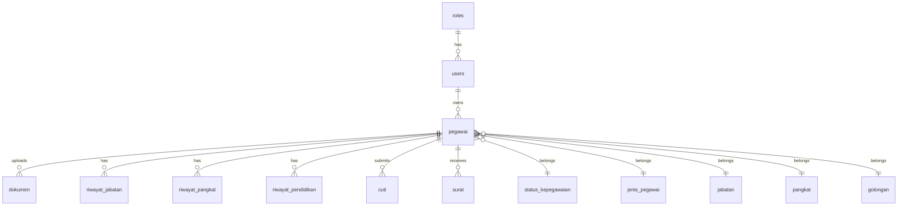

# 📘 03-DATABASE.md
# SIMPEG SMAN 1 PRAMBON
## Database Design Specification

Version: 1.0.0

---

# 1. Database Philosophy

Database dirancang dengan prinsip:

- PostgreSQL sebagai database utama.
- Normalisasi hingga 3NF.
- UUID sebagai Primary Key.
- Soft Delete pada data transaksional.
- Audit Trail untuk seluruh perubahan penting.
- Mendukung ekspansi modul di masa depan.

---

# 2. Konvensi

| Item | Standar |
|------|----------|
| PK | uuid |
| FK | *_id |
| Tabel | snake_case |
| Kolom | snake_case |
| Timestamp | created_at, updated_at |
| Soft Delete | deleted_at |

---

# 3. Entity Relationship (Level Tinggi)

---

# 4. Master Tables

- users
- roles
- permissions
- role_user
- permission_role

- pegawai
- jenis_pegawai
- status_kepegawaian

- jabatan
- golongan
- pangkat
- unit_kerja
- mata_pelajaran
- agama
- pendidikan

---

# 5. Transaction Tables

- dokumen
- surat
- cuti
- notifikasi
- aktivitas_login

---

# 6. History Tables

- riwayat_pendidikan
- riwayat_jabatan
- riwayat_pangkat
- riwayat_kgb
- riwayat_mutasi
- riwayat_diklat

---

# 7. Audit Tables

- audit_logs
- api_logs
- activity_logs

---

# 8. Tabel Inti : pegawai

Kolom utama:

- id
- nip
- nuptk
- nik
- nama
- gelar_depan
- gelar_belakang
- tempat_lahir
- tanggal_lahir
- jenis_kelamin
- agama_id
- alamat
- email
- no_hp
- jenis_pegawai_id
- status_kepegawaian_id
- jabatan_id
- pangkat_id
- golongan_id
- unit_kerja_id
- foto
- status_aktif

---

# 9. Relasi

pegawai

↓

dokumen

↓

riwayat

↓

surat

↓

cuti

Seluruh histori tetap tersimpan meskipun data master berubah.

---

# 10. Soft Delete

Soft delete diterapkan pada:

- pegawai
- dokumen
- surat
- cuti

Master referensi tidak menggunakan soft delete kecuali diperlukan.

---

# 11. Index

Index wajib pada:

- nip
- nik
- email
- no_hp
- status_kepegawaian_id
- jabatan_id
- unit_kerja_id

---

# 12. Constraint

- NIP unik
- NIK unik
- Email unik
- Foreign Key wajib menggunakan ON UPDATE CASCADE
- Penghapusan data master dibatasi (RESTRICT)

---

# 13. File Storage Mapping

pegawai/
foto/

dokumen/
ktp/
kk/
ijazah/
sertifikat/
sk/

surat/

---

# 14. Seed Data

Seeder awal:

- Role
- Permission
- Agama
- Jenis Pegawai
- Status Kepegawaian
- Pangkat
- Golongan
- Unit Kerja

---

# 15. Migration Order

1. users
2. roles
3. permissions
4. master tables
5. pegawai
6. history tables
7. transaction tables
8. audit tables

---

# 16. Future Expansion

Disiapkan untuk:

- Payroll
- Absensi
- Fingerprint
- e-Kinerja
- Integrasi Dapodik
- Mobile API

---

# 17. Database Rules

- Tidak boleh hard delete data pegawai.
- Semua perubahan penting masuk audit_logs.
- Semua relasi menggunakan foreign key.
- Semua tabel memiliki created_at dan updated_at.

---

# 18. Closing

Dokumen ini menjadi dasar penyusunan migration, model,
repository, service, dan API pada seluruh modul SIMPEG.
